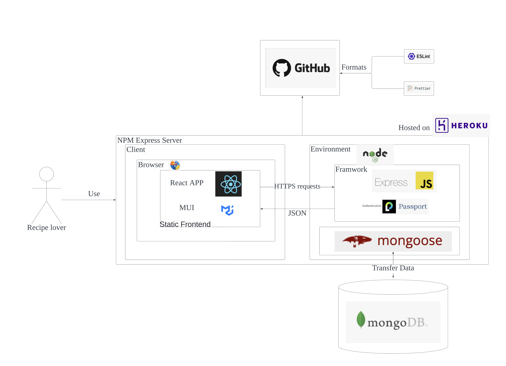

# Dont Forget Your Recipe


## 🚀 About The Team

Team 70: dont-forget-ur-password

**Contributors**

<a href="https://github.com/Harry-Guanqin-Wang/IT-Project/graphs/contributors">
  
</a>


| Name      | Email                             |
| :-------- | :-------------------------------- |
| [Terrance, Tianqi Wang](https://github.com/terrance2630) |  tww2@student.unimelb.edu.au |
| [Kevin, Bowen Fan](https://github.com/bowenfan-unimelb) |    bffa@student.unimelb.edu.au  |
| [Yung, Yung-Ching Lin](https://github.com/joycekyery) |   yungchingl@student.unimelb.edu.au |
| [Jerry, Ngoc Bao Luong](https://github.com/Jerry2108) |  ngocbaol@student.unimelb.edu.au |
| [Harry, Guanqin Wang](https://github.com/Harry-Guanqin-Wang) |   guanqinw@student.unimelb.edu.au |


## Product Requirement
> University of Melbourne: COMP30022 IT Capstone Project 
>
> Semester2, 2022

Personal Item Register


## Product Description
A website based application to track and share your recipes. You can create your own recipes here, label them into your own categories. You can also view and share recipes in our food-lover community, where users can rate and comment each other's favourite dishes. Last, don't forget to put on a red heart for recipes you like, so that they are tracked in your _personal kitchen_.  


## Documentation

We use Confluence 
[Confluence Team Space](https://dontforgeturpword.atlassian.net/wiki/spaces/TEAM70/overview)


## Architecture


## Usage

**Installtion**

The project us `yarn` as front-end package management tool, 
`npm` as back-end package management tool. Install dependecies independently

Install dependecies for front-end

```bash
  cd front-end
  yarn install
```
    

Install dependecies for back-end

```bash
  cd front-end
  npm install
```

To run the project, go to root folder and run:
```bash
  npm run dev
```
_This will start both frontend and backend concurrently_

**Build**

**Testing**
```bash
  npm test
```
## Configuration

**Environment Variable**

To run this project, you will need to add the following environment variables to your .env file

```bash
PORT=<server port>
DATABASE= <mongoDB>
DATABASE_COMPASS=<MongoDB>
ENVIRONMENT=<process environment>
COOKIE_SECRET=<Cookie secret>
BASE_URL=<server base url>
BASE_URL_FRONT_END= <frontend base url>


#google service
GOOGLE_CLIENT_ID=<google client ID>
GOOGLE_CLIENT_SECRET= <google client secret>
EMAIL_USER=<email sender>
EMAIL_USER_2=<email sender 2>
EMAIL_PASS=<email sender password >
EMAIL_PASS_2=<email sender password 2>
HOST=""
SERVICE="gmail"
```

**HTTPS & CA**

add ... to your computer


## Contributing

_branches & ci cd_

# Deployment

See the deploy on Heroku:
https://dont-recipe-frontback.herokuapp.com/

### Set up Heroku

#### Settings on Heroku:

BuildPack:
`heroku/nodejs`

Application requires the same environemnt variable that need to be set under `Project Setting => Config Vars`

Download and install the [Heroku CLI](https://devcenter.heroku.com/articles/heroku-cli).

If you haven't already, log in to your Heroku account and follow the prompts to create a new SSH public key.
`heroku login`

Set up Heroku in your local repository, run:
`heroku git:remote -a <heroku name>`

#### Deploy Process
Scripts had already been setup for the deploy process

Our npm server serves a static frontend build. 

Heroku runs the script under`heroku-postbuild` first to create the frontend build. 
After the build is done successfully, Heroku runs `npm start` and start running the server.


### To Deploy:

run:
`git push heroku <branch>`


# Getting Started with frontend

### :bangbang: Prerequisite

This project is run by:

### `yarn`

check if you have yarn installed by running:
`yarn --version`


Installing yarn through npm:
`npm install --global yarn`

see [more about yarn](https://classic.yarnpkg.com/en/docs/getting-started)

## Run The App Locally

If you just cloned the repository, run:

### `yarn install`

to install dependencies, no need to run it again until there is a change in dependecies.

### `yarn start`
or 
### `yarn start:windows`
for windows environment

Runs the app in the development mode.\
Open [https://localhost:3000](https://localhost:3000) to view it in your browser.

The page will reload when you make changes.\
You may also see any lint errors in the console.

### When there is changes in dependencies

:pray: :bangbang:Please inform everyone when you upgrade/install packages.
To update, delete folder `/node_modules` completely and run `yarn install`to install all dependencies again in order to prevent conflicts.


## Coding Style

Enforced by Prettier and ESlint
Make sure to use `VScode` and install extensions

#### [`Prettier`](https://marketplace.visualstudio.com/items?itemName=esbenp.prettier-vscode) [`ESlint`](https://marketplace.visualstudio.com/items?itemName=dbaeumer.vscode-eslint)

#### Setup Auto formatting
use `crtl+shift+p` to open Vscode panel

under the panel, type and select `format document wit`h, choose `Prettier` as the formatter

In VScode settings, find `Editor: format on save` and click on the option.

### End-of-Line Character Sequences: LF

Check at the bottom line of your VScode

:bangbang: if you are on Windows system, git will tempt to convert LF to CRLF. To cahnge this, configured your git by
`git config core.autocrlf false`

### Using PropTypes
import PropTypes with
`import PropTypes from 'prop-types'`

example:

```
const Component =({prop1='', prop2=()=>{})=>{

}

Component.propTypes = {
    /** description of the prop**/
    prop1=PropTypes.string,
    prop2=PropTypes.func,
}
```
[see more about typechecking and using PropTypes](https://reactjs.org/docs/typechecking-with-proptypes.html)
